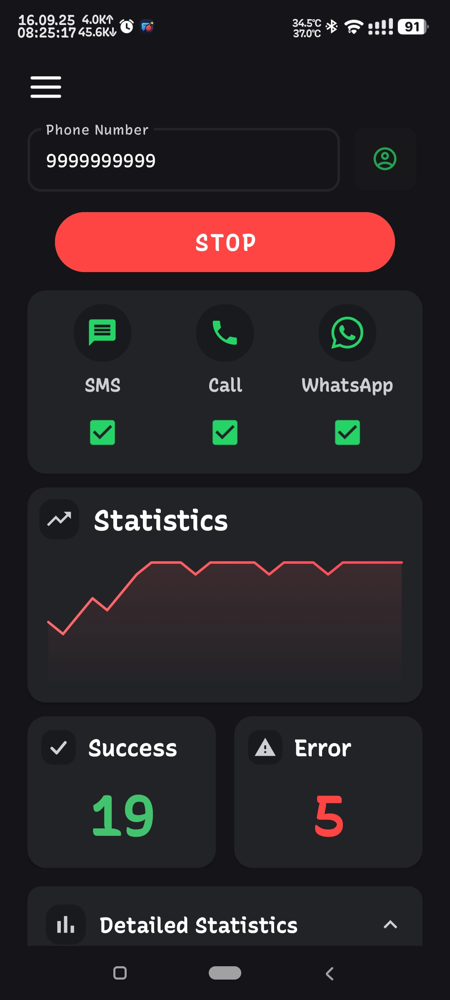
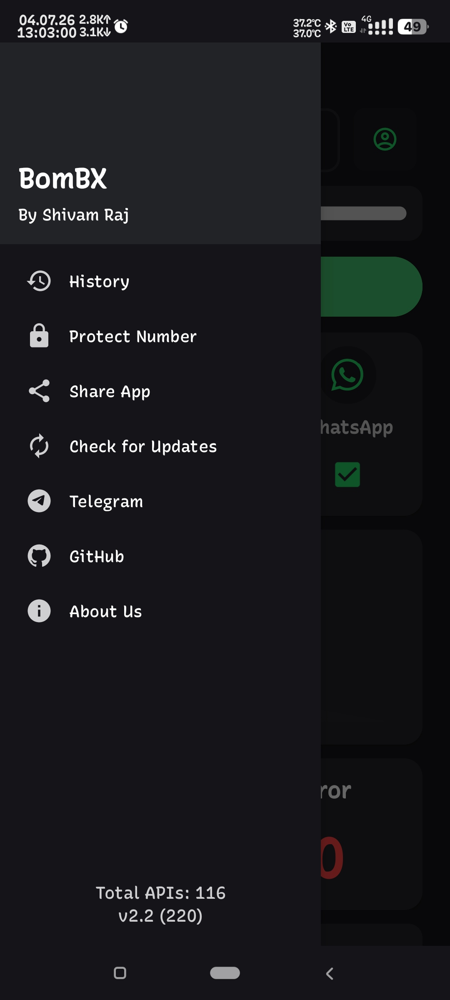
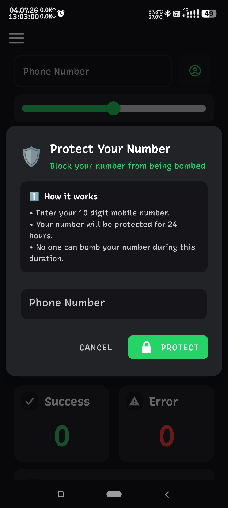
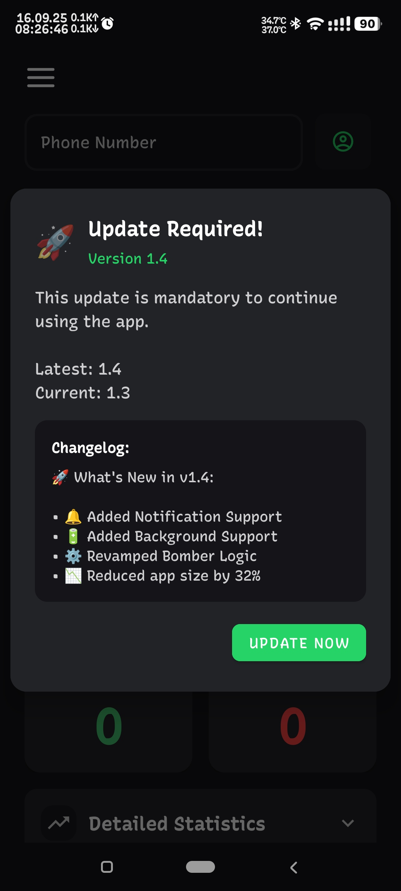
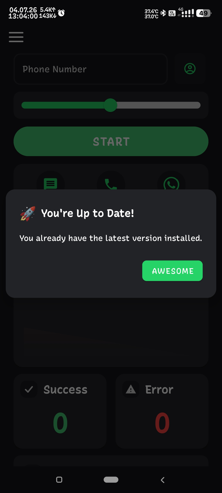
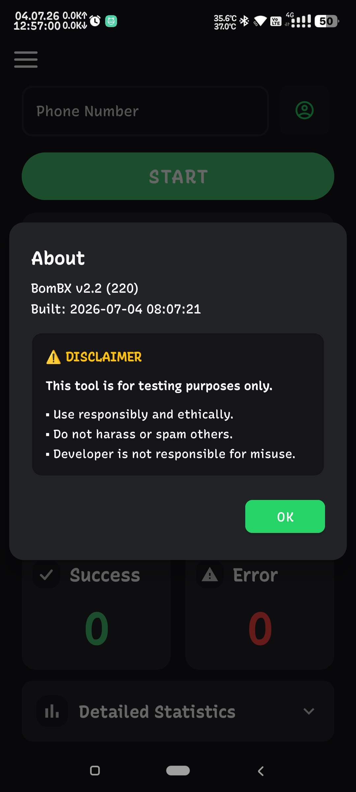
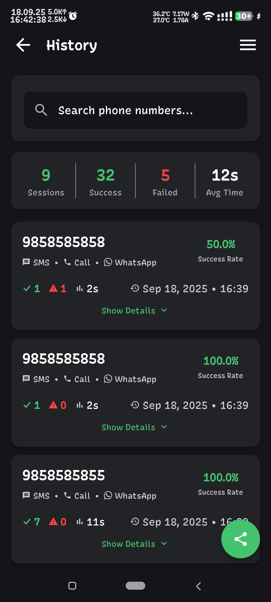
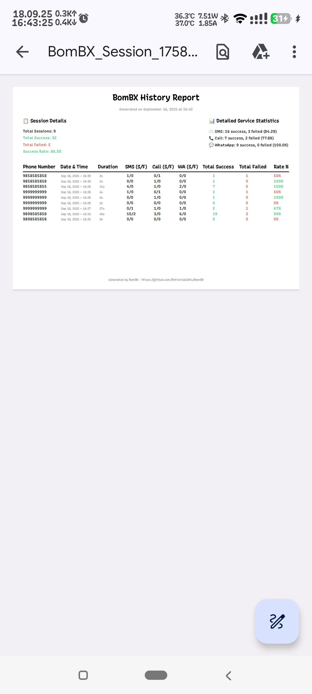

# BomBX

**⚡ Advanced SMS Bomber for Android**

A powerful SMS, Call & WhatsApp bombing tool for educational and testing purposes.

## 📌 Important Note

**This application currently works only with Indian phone numbers (+91).**

## ✨ Features

- **SMS Bombing:** Send multiple SMS messages through various APIs
- **Call Bombing:** Make multiple calls through different APIs
- **WhatsApp Support:** Send multiple WhatsApp messages through various APIs
- **Rate Limiting:** Built-in sleep functionality to respect API limits
- **Number Protection:** Protect your number from bombing attempts

## 📱 Screenshots

  <table>
    <tr>
      <td></td>
      <td></td>
    </tr>
    <tr>
      <td></td>
      <td></td>
    </tr>
    <tr>
      <td></td>
      <td></td>
    </tr>
    <tr>
      <td></td>
      <td></td>
    </tr>
    
  </table>

*Clean modern interface with intuitive controls and real-time feedback*

## ⚠️ Disclaimer

**IMPORTANT**: This application is strictly for **TESTING PURPOSES ONLY**.

- DO NOT use this tool to harass others
- DO NOT use this for illegal activities  
- DO NOT use this to spam innocent people
- Use responsibly and ethically

## 📊 Project Statistics

<a href="https://star-history.com/#bettercallshiv/BomBX&Date">
<picture>
<source media="(prefers-color-scheme: dark)" srcset="https://api.star-history.com/svg?repos=BetterCallShiv/BomBX&type=Date&theme=dark" />
<source media="(prefers-color-scheme: light)" srcset="https://api.star-history.com/svg?repos=BetterCallShiv/BomBX&type=Date" />

</picture>
</a>

## 👨‍💻 Author

**Shivam Raj** ([@BetterCallShiv](https://github.com/BetterCallShiv))
- Email: [bettercallshiv@gmail.com](mailto:bettercallshiv@gmail.com)
- GitHub: [github.com/BetterCallShiv](https://github.com/BetterCallShiv)
