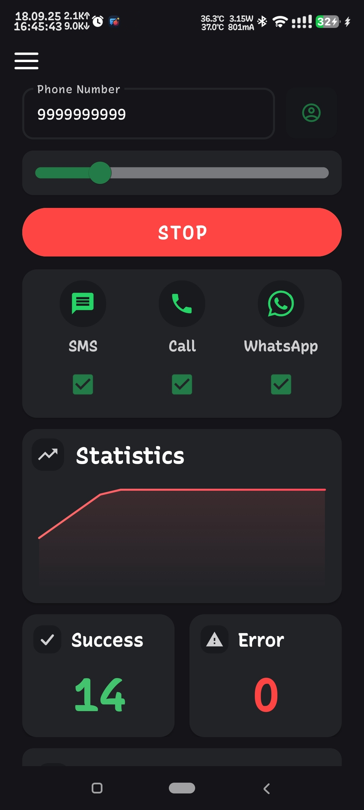
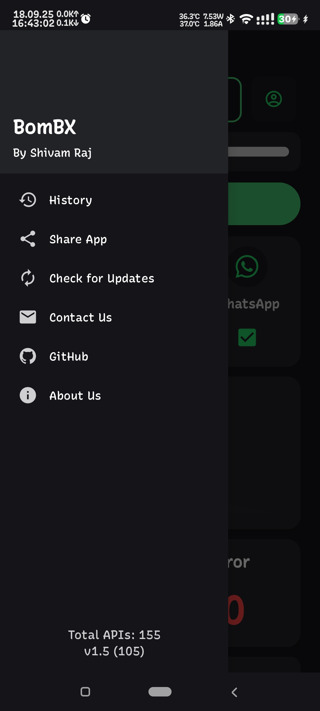
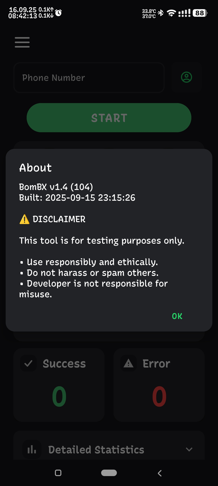

# BomBX

**⚡ Advanced SMS Bomber for Android**

A powerful SMS, Call & WhatsApp bombing tool for educational and testing purposes.

## 📌 Important Note

**This application currently works only with Indian phone numbers (+91).**  
Phone numbers from other countries are not supported at this time.

## ✨ Features

- **SMS Bombing**: Send multiple SMS messages through various APIs
- **Call Bombing**: Make multiple calls through different APIs
- **WhatsApp Support**: Send multiple WhatsApp messages through various APIs
- **Rate Limiting**: Built-in sleep functionality to respect API limits

## 📱 Screenshots

  <table>
    <tr>
      <td></td>
      <td></td>
    </tr>
    <tr>
      <td></td>
      <td></td>
    </tr>
    <tr>
      <td></td>
      <td></td>
    </tr>
  </table>

*Clean modern interface with intuitive controls and real-time feedback*

## 🔒 Privacy & Security
- No personal data storage or transmission
- Local-only phone number processing
- No tracking or analytics collection

## ⚠️ Disclaimer

**IMPORTANT**: This application is strictly for **TESTING PURPOSES ONLY**.

- DO NOT use this tool to harass others
- DO NOT use this for illegal activities  
- DO NOT use this to spam innocent people
- Use responsibly and ethically

## 👨‍💻 Author

**Shivam Raj** ([@BetterCallShiv](https://github.com/BetterCallShiv))
- Email: [bettercallshiv@gmail.com](mailto:bettercallshiv@gmail.com)
- GitHub: [github.com/BetterCallShiv](https://github.com/BetterCallShiv)
